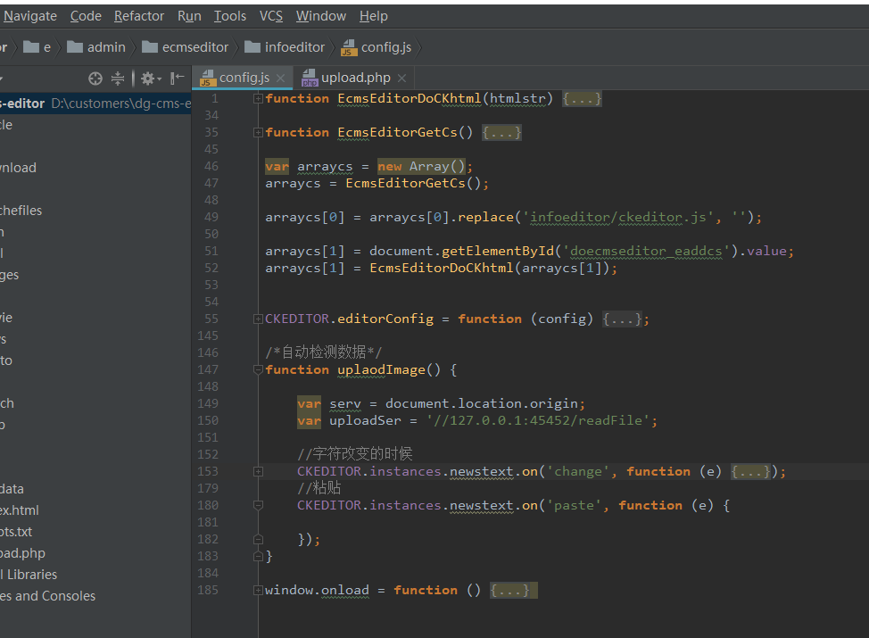
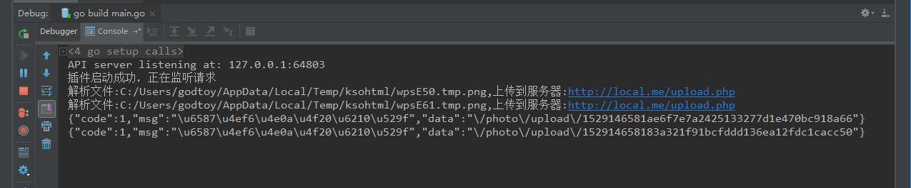

## 说明
在普通浏览器编辑器中，复制word中的文档信息，粘贴到word后是
有css样式的，但是图片都是本地的```file://``协议，浏览器不可以
读取本地文件的file协议文件，所以需要我们自己做一个插件或者用
其他手段读取，我相信其他的插件是同样的原理，都是为了去读取
本地文件后上传或者发送给浏览器。

>注：word的paste时间中的剪切板data中没有img的信息。如果只是复制了
图片或者截图什么的，我们可以直接获取简洁版的data数据


## 案例，例如在帝国cms中的编辑器


``` javascript

/*自动检测数据*/
function uplaodImage() {

    var serv = document.location.origin;
    var uploadSer = '//127.0.0.1:45452/readFile';

    //字符改变的时候
    CKEDITOR.instances.newstext.on('change', function (e) {
        var a = e.editor.document;
        var b = a.find("img");
        var count = b.count();
        for (var i = 0; i < count; i++) {
            var src = b.getItem(i).$.src;//获取img的src
            src = src.replace(/file:\/\/\//g, '');
            var url = uploadSer + '?server=' + serv + '&file=' + src;
            (function (url, ins) {
                MyAjax({
                    type: "GET",
                    url: url,
                    //async: false,//同步，因为修改编辑器内容的时候会多次调用change方法，所以要同步，否则会多次调用后台
                    success: (res) => {
                        res = JSON.parse(res);
                        if (res.code === 1) {
                            var imgUrl = serv + res.data;
                            ins.setAttribute('src', imgUrl);
                            ins.setAttribute('data-cke-saved-src', imgUrl);
                        }
                        console.log("替换字符成功")
                    }
                });
            })(url, b.getItem(i).$);
        }
    });
    //粘贴
    CKEDITOR.instances.newstext.on('paste', function (e) {

    });
}

window.onload = function () {
    function ajax() {
        var ajaxData = {
            type: arguments[0].type || "GET",
            url: arguments[0].url || "",
            async: arguments[0].async || "true",
            data: arguments[0].data || null,
            dataType: arguments[0].dataType || "text",
            contentType: arguments[0].contentType || "application/x-www-form-urlencoded",
            beforeSend: arguments[0].beforeSend || function () {
            },
            success: arguments[0].success || function () {
            },
            error: arguments[0].error || function () {
            }
        }
        ajaxData.beforeSend()
        var xhr = createxmlHttpRequest();
        xhr.responseType = ajaxData.dataType;
        xhr.open(ajaxData.type, ajaxData.url, ajaxData.async);
        xhr.setRequestHeader("Content-Type", ajaxData.contentType);
        xhr.send(convertData(ajaxData.data));
        xhr.onreadystatechange = function () {
            if (xhr.readyState == 4) {
                if (xhr.status == 200) {
                    ajaxData.success(xhr.response)
                } else {
                    ajaxData.error()
                }
            }
        }
    }

    function createxmlHttpRequest() {
        if (window.ActiveXObject) {
            return new ActiveXObject("Microsoft.XMLHTTP");
        } else if (window.XMLHttpRequest) {
            return new XMLHttpRequest();
        }
    }

    function convertData(data) {
        if (typeof data === 'object') {
            var convertResult = "";
            for (var c in data) {
                convertResult += c + "=" + data[c] + "&";
            }
            convertResult = convertResult.substring(0, convertResult.length - 1)
            return convertResult;
        } else {
            return data;
        }
    }

    window.MyAjax = ajax;
    setTimeout(uplaodImage, 400);
}

```
通过绑定文本的change事件来检索这篇文档存在的file协议的文件信息。


## 运行插件程序
其实原理简单，就是开一个本地server去拉取本地的文件数据




## 安全
其中这个程序其实并不安全，上传和校验图片都没有完全进行任何的
安全判断。
你应该做的事情：
-   1.浏览器端证书安全校验
-   2.服务器端判断是否是程序上传的安全校验
-   3.非法图片的安全校验